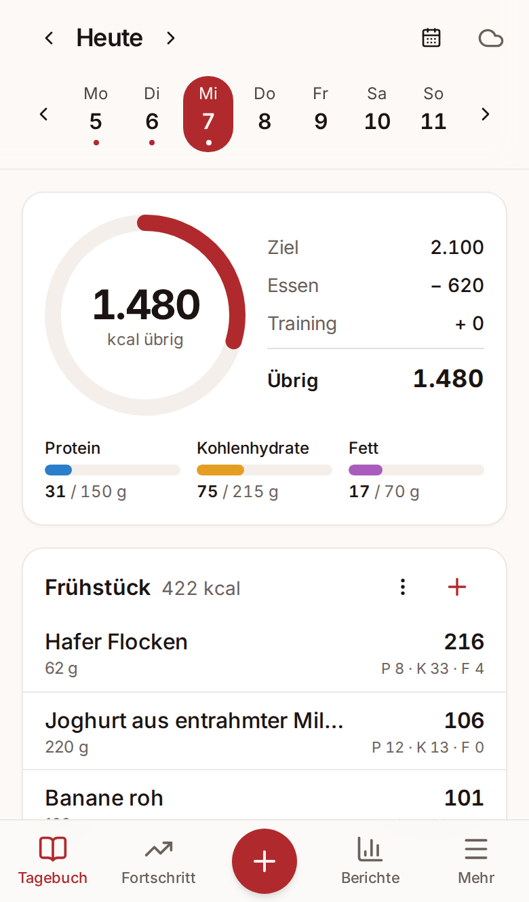
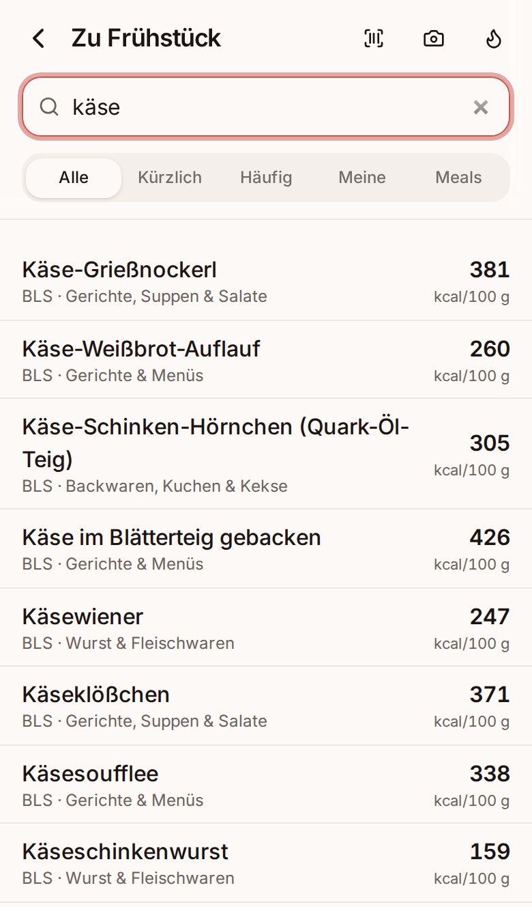
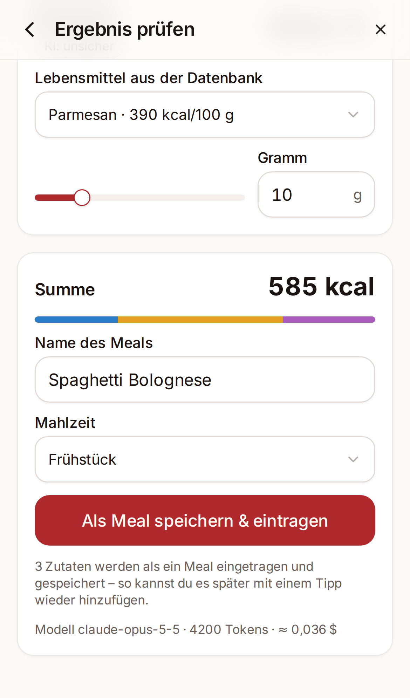
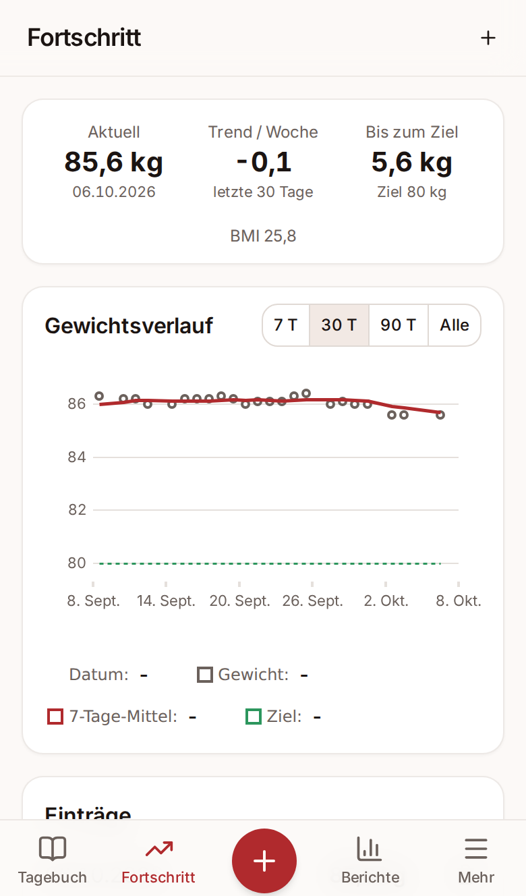
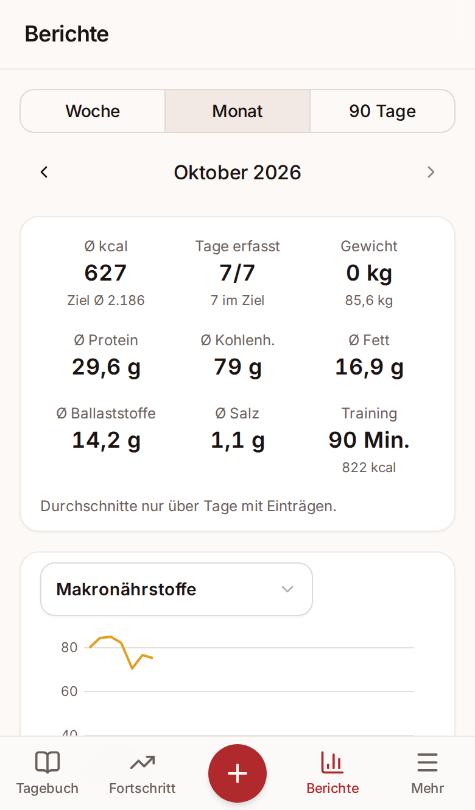
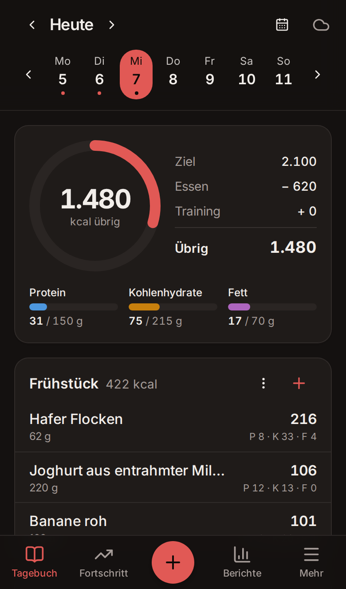

# Fleisch-Teufel

Ein selbst gehostetes Ernährungstagebuch nach dem Vorbild von MyFitnessPal, als **Progressive Web App
fürs iPhone**, die **offline** funktioniert und sich mit deinem eigenen Server synchronisiert.
Lebensmitteldaten kommen aus dem **Bundeslebensmittelschlüssel (BLS 4.0)** und **Open Food Facts**;
Mahlzeiten lassen sich zusätzlich **per Foto mit KI** erfassen.

<p align="center">
  
  
  
</p>
<p align="center">
  
  
  
</p>

## Funktionen

|     | Funktion                                                                                                                                                                                                                                                                                                                                                                                                                                                                                                                                                                                                                                                                                                                                                                                    |
| --- | ------------------------------------------------------------------------------------------------------------------------------------------------------------------------------------------------------------------------------------------------------------------------------------------------------------------------------------------------------------------------------------------------------------------------------------------------------------------------------------------------------------------------------------------------------------------------------------------------------------------------------------------------------------------------------------------------------------------------------------------------------------------------------------------- |
| 📒  | **Tagebuch** mit vier (umbenennbaren) Mahlzeiten, Wochenleiste, Datumswahl per Tipp auf den Tag, Kalorienring „Ziel − Essen + Training“, Makro-Balken, Einträge bearbeiten, per Wischen löschen oder per langem Druck in eine andere Mahlzeit ziehen (beides mit Rückgängig), Meals als aufklappbare Zeile (bleibt offen, wenn man einen Eintrag ansieht); Tipp auf eine Mahlzeit öffnet ihre eigene Seite mit Nährstoffübersicht, Einträgen und Speichern-Icon („Als Meal speichern“); das „+“ öffnet die Essen-Seite für genau diese Mahlzeit. Das „+“ der Tab-Leiste bietet Training, Essen und Gewicht eintragen                                                                                                                                                                        |
| 🔎  | **Lebensmittelsuche** offline über 7.140 BLS-Lebensmittel (umlaut-tolerant: „Kaese“ findet „Käse“) plus Markenprodukte von Open Food Facts; bereits gegessene Lebensmittel stehen in den Treffern oben; Tabs Häufig/Kürzlich/Eigene (mit aufklappbaren Meals; Tippen im Reiter „Eigene“ filtert nur eigene Lebensmittel und Meals)                                                                                                                                                                                                                                                                                                                                                                                                                                                          |
| ⚖️  | **Portionen**: Gramm, Haushaltsmaße, Portionen von der Verpackung, eigene Portionen je Lebensmittel; **ein Mengen-Editor überall** (Eintragen, Foto-Analyse, Meals): Einheit wählen, Slider mit der Startmenge in der Mitte, − / + und Feld                                                                                                                                                                                                                                                                                                                                                                                                                                                                                                                                                 |
| 📷  | **Barcode-Scanner** mit der iPhone-Kamera (ZXing-WebAssembly, funktioniert auch ohne nativen BarcodeDetector), Taschenlampe, sofern das Gerät sie freigibt                                                                                                                                                                                                                                                                                                                                                                                                                                                                                                                                                                                                                                  |
| ✨  | **KI-Foto-Logging** auf der Essen-Seite (Kamera, Barcode, Blitz zur Schnelleingabe, Lupe zur Suche): Foto → Vorschau mit optionalem Hinweis → „Analysieren“ → Claude erkennt Lebensmittel und schätzt Gramm → Zuordnung zu BLS/Open Food Facts → du korrigierst (einzeln oder alle Mengen auf einmal per „Gesamtmenge“, Nährwerte je Zutat aufklappbar), ergänzt fehlende Zutaten oder lässt mit geändertem Hinweis per ↻ neu analysieren → „Meal eintragen“ als benannte Gruppe, auf Wunsch vorher über das Speichern-Icon als **gespeichertes Meal mit Foto** abgelegt (z. B. „Spaghetti Bolognese“), jederzeit wieder eintragbar. Nährwerte kommen **immer aus der Datenbank**, nie vom Modell. Offline aufgenommene Fotos werden später analysiert                                      |
| ⚡  | **Schnelleingabe** (kcal + Makros), **eigene Lebensmittel** in der Form der Nährstoffübersicht (Kalorien rechnen sich nach EU-Formel aus den Makros und lassen sich überschreiben, kJ und Natrium rechnen mit, pro 100 g oder pro Portion, Barcode per Kamera) oder **per Foto vom Etikett** (bis zu 3 Fotos, Claude schreibt die aufgedruckten Werte ab, du prüfst vor dem Speichern), **gespeicherte Meals** mit Foto: Editor unter Mehr oder per Stift beim Eintragen (Zutaten mit Mengen-Slidern und Nährwerten, Gesamtmenge, Foto; Speichern führt zurück), Eintragen aus der Suche mit 0,5× bis 2× und Zutaten, die nur für diesen Eintrag weggewischt werden; gelöschte Meals, gespeicherte Trainings und Gewichtseinträge liegen im **Papierkorb** und lassen sich wiederherstellen |
| 🎯  | **Onboarding** mit Grundumsatz nach Mifflin-St Jeor, Aktivitätsfaktor, Zielgewicht und Wochentempo; **Makro-Vorlagen** (Ausgewogen, Proteinreich, Diät/Muskelerhalt, Low Carb oder eigene g Eiweiß/kg) und **Makroziele in Gramm je Wochentag**; Ziel-Historie, damit alte Tage korrekt bewertet bleiben                                                                                                                                                                                                                                                                                                                                                                                                                                                                                    |
| 🥦  | **Nährstoffübersicht**, überall gleich (Lebensmittel, Meal, Foto-Analyse, Mahlzeit, Tag, Berichte): kcal, Energieverteilung der Makros als voller Balken, Makros mit Anteil (Tipp auf die kcal-Zahl zeigt den Anteil am Tagesziel), Überschuss rot markiert (ab doppeltem Ziel in einer zweiten, dunkleren Stufe, auch für Zucker, gesättigte Fettsäuren und Salz); Ballaststoffe, Zucker, gesättigte Fettsäuren und Salz mit DGE-Orientierungswerten (eigene Ziele möglich) und alle 138 BLS-Nährstoffe der Menge                                                                                                                                                                                                                                                                          |
| 📉  | **Gewicht** per Maßband (0,05-kg-Raster) oder genauem Wert, mit Chart, 7-Tage-Mittel, Trend pro Woche und Zielgewichtslinie                                                                                                                                                                                                                                                                                                                                                                                                                                                                                                                                                                                                                                                                 |
| 🏃  | **Training (einfach)**: 38 Sportarten mit MET-Werten (Compendium of Physical Activities) oder eigene; Verbrauch = (MET − 1) × kg × h, optional aufs Tagesziel angerechnet; Notiz (z. B. Übungen/Sätze), **gespeicherte Trainings** (über das Speichern-Icon, unter Mehr bearbeitbar, mit Papierkorb) und Schnellauswahl der letzten 5 Trainings                                                                                                                                                                                                                                                                                                                                                                                                                                             |
| 📝  | **Tagesnotiz** und **„Tag abschließen“** mit 5-Wochen-Gewichtsprognose                                                                                                                                                                                                                                                                                                                                                                                                                                                                                                                                                                                                                                                                                                                      |
| 📊  | **Berichte** für Woche/Monat/90 Tage (kcal als Balken nach Makros geteilt, Makros, Gewicht, Nährstoffe) und **CSV-Export** (Excel-tauglich oder Standard) sowie JSON-Sicherung                                                                                                                                                                                                                                                                                                                                                                                                                                                                                                                                                                                                              |
| 📴  | **Offline-first**: Alles läuft ohne Verbindung; Sync beim Öffnen, beim Wechsel in den Hintergrund und wenn das Netz zurückkommt                                                                                                                                                                                                                                                                                                                                                                                                                                                                                                                                                                                                                                                             |

Bewusst **nicht** enthalten: Wasser, Streaks/Erinnerungen, Fasten, Rezepte, Community, Meal-Pläne,
Health-Sync, Widgets.

## Architektur

```
apps/web        React 19 · Vite · Tailwind v4 · shadcn/ui · TanStack Router · Dexie (IndexedDB)
                vite-plugin-pwa (Workbox) · uPlot · barcode-detector (ZXing wasm)
apps/api        Hono auf Node 22 · Drizzle ORM · PostgreSQL 17 · Argon2id · Anthropic SDK
packages/shared Zod-Schemas, Domain-Logik (TDEE, Makros, MET, Prognose, Suche, LWW-Regel, CSV)
tools/bls-import  BLS-4.0-XLSX → JSON (voll für den Server, kompakt für die Offline-Suche)
```

- **Ein Docker-Image** liefert API und PWA auf Port 3000 aus; beim Start laufen die Datenbank-Migrationen
  und der BLS-Katalog wird (einmal pro BLS-Version) in PostgreSQL geschrieben.
- **Sync**: Last-Write-Wins über REST mit serverseitigem Sequenz-Cursor, Soft-Deletes und deterministischen
  IDs für „einmal pro Tag“-Daten. Details: [`docs/sync.md`](docs/sync.md).
- **Mehrbenutzerfähig** von Anfang an (jede Zeile gehört einem Nutzer); Registrierung ist nach dem ersten
  Konto per Schalter geschlossen.
- **Datenschutz**: Fotos (Teller und Etiketten) werden nur zur Analyse an Anthropic geschickt und nicht
  gespeichert; gespeichert werden Tokenverbrauch und das Ergebnis (erkannte Lebensmittel bzw. abgelesene
  Werte, für Kostenkontrolle und Genauigkeitsauswertung).

## Datenquellen & Lizenzen

- **BLS 4.0**: Max Rubner-Institut (2025): Bundeslebensmittelschlüssel (BLS), Version 4.0. Karlsruhe.
  Kostenfrei und ohne Lizenzbarrieren bereitgestellt ([blsdb.de](https://www.blsdb.de)). Die aufbereiteten
  Dateien liegen in `apps/api/data/` und `apps/web/public/data/` und werden mit `pnpm bls:import` neu erzeugt.
- **Open Food Facts**: Produktdaten © Open-Food-Facts-Mitwirkende, [ODbL 1.0](https://opendatacommons.org/licenses/odbl/1-0/).
  Abfragen laufen über den Server (Cache, Rate-Limits 15/min Produkt, 10/min Suche, eigener User-Agent).
- **MET-Werte**: Compendium of Physical Activities (Ainsworth et al. 2011; Herrmann et al. 2024), gerundet.
- **DGE**: Orientierungswerte für Ballaststoffe, Salz, Zucker und gesättigte Fettsäuren (Quellen im Code,
  `packages/shared/src/goals.ts`).
- **Schrift** Inter (SIL Open Font License 1.1). **Code**: [MIT](LICENSE).

## Entwicklung

Voraussetzungen: Node 22, pnpm (`corepack enable`). Kein Docker nötig, die Entwicklungsdatenbank ist ein
eingebettetes PostgreSQL 17.

```bash
pnpm install
pnpm dev                       # API :3000 (+ eingebettetes PostgreSQL) und Vite :5173
pnpm --filter @ft/api seed:demo  # optional: Demo-Konto mit 6 Wochen Daten (demo@fleisch-teufel.local / demo-password)
```

Geheimnisse liegen in `.env` im Projektordner (gitignored), z. B. `ANTHROPIC_API_KEY=…` für die Foto-Analyse.

| Befehl                                        | Zweck                                                                                                              |
| --------------------------------------------- | ------------------------------------------------------------------------------------------------------------------ |
| `pnpm test`                                   | Unit- und Integrationstests (API-Tests gegen echtes PostgreSQL 17)                                                 |
| `pnpm e2e`                                    | Playwright-Smoke-Test: Registrieren → eintragen → **offline neu laden** → offline eintragen → Sync → zweites Gerät |
| `pnpm lint` / `pnpm typecheck` / `pnpm build` | ESLint + Prettier, TypeScript, Produktions-Build                                                                   |
| `pnpm bls:import`                             | BLS herunterladen, prüfen (7.140 Lebensmittel, 138 Nährstoffe, Hafer = 343 kcal) und konvertieren                  |
| `pnpm --filter @ft/api db:generate`           | Drizzle-Migration aus dem Schema erzeugen                                                                          |
| `pnpm --filter @ft/api ai:eval <ordner>`      | KI-Genauigkeit gegen eigene, gewogene Tellerfotos messen (siehe unten)                                             |

## Deployment mit Dockge

Bei jedem Push auf `main` baut GitHub Actions das Image und veröffentlicht es als
`ghcr.io/david-stefan-hermann/fleisch-teufel:latest` (plus `:sha-<commit>`), nachdem es einen
Smoke-Test gegen PostgreSQL bestanden hat.

1. **Datenverzeichnis** anlegen (einmalig): `/mnt/tank/applications/fleisch-teufel/postgres`.
2. In Dockge **„+ Compose“**, Name `fleisch-teufel`, Inhalt von [`deploy/docker-compose.yml`](deploy/docker-compose.yml) einfügen.
3. Im **.env-Editor** des Stacks die Variablen aus [`deploy/.env.example`](deploy/.env.example) setzen:
   mindestens `POSTGRES_PASSWORD` (lang, zufällig), `ANTHROPIC_API_KEY` (optional) und `OFF_CONTACT_EMAIL`.
4. **Deploy**. Nach ~30 s liefert `http://<nas>:30300/health` `{"ok":true,…}`.
5. Reverse Proxy (Nginx Proxy Manager): Host → `http://<nas-ip>:30300`, SSL erzwingen, Websockets an,
   Zugriffsliste nach Wunsch (z. B. nur LAN/VPN). Die App wertet `X-Forwarded-Proto` aus und setzt das
   Sitzungs-Cookie dann als `Secure`.
6. App öffnen, **erstes Konto registrieren** (das erste Konto ist immer erlaubt; danach bleibt die
   Registrierung mit `ALLOW_REGISTRATION=false` geschlossen).
7. **Updates**: in Dockge „Update“ drücken. Das zieht das neue `:latest` und startet neu; Migrationen laufen
   automatisch.

**Backup**: Das PostgreSQL-Verzeichnis per ZFS-Snapshot sichern; zusätzlich kann jedes Gerät unter
„Mehr → Daten & Sync“ eine JSON-Sicherung herunterladen.

## Auf dem iPhone installieren

1. Seite in **Safari** öffnen und anmelden. Nach ein paar Sekunden erscheint oben das Banner
   „Fleisch-Teufel, Kostenlos, ohne App Store“; „Installieren“ zeigt die Schritte.
2. **Teilen → „Zum Home-Bildschirm“ → „Hinzufügen“**. Erst als Home-Bildschirm-App sind die Offline-Daten
   dauerhaft (Safari löscht sonst Website-Daten nach 7 Tagen ohne Nutzung).
3. Kamera erlauben, wenn der Barcode-Scanner das erste Mal startet. Damit Safari nicht bei jedem Scan neu
   fragt: iOS-Einstellungen → Apps → Safari → Kamera → „Erlauben“.

Android: In Chrome öffnet „Installieren“ im Banner direkt den Installationsdialog. Am Computer führt der
Knopf „Aufs Handy“ zu einem QR-Code der App.

Grenzen von iOS: Der Mediathek-Knopf auf der Foto-Seite öffnet das iOS-Auswahlblatt (Fotomediathek,
Foto aufnehmen, Datei auswählen); eine Web-App kann die Mediathek nicht direkt öffnen. Die Taschenlampe
erscheint nur, wenn Safari sie für die Kamera meldet, was nicht auf jedem iPhone der Fall ist.

## KI-Genauigkeit messen

Mengenschätzung aus Fotos ist prinzipiell ungenau (typisch ±20 bis 40 %). So misst du es mit deinem Essen:

1. ~10 Teller fotografieren und die Bestandteile vorher **wiegen**.
2. Ordner mit den Fotos und einer `truth.json` anlegen:
   ```json
   [
     {
       "file": "pasta.jpg",
       "kcal": 780,
       "items": [
         { "name": "Spaghetti gekocht", "grams": 250 },
         { "name": "Bolognese", "grams": 180 }
       ]
     }
   ]
   ```
3. `ANTHROPIC_API_KEY=… pnpm --filter @ft/api ai:eval ./mein-testset` gibt je Foto die Abweichung bei
   Gramm und kcal aus und schreibt `report.json` (Kosten ≈ 0,03 $ pro Foto mit `claude-opus-5-5`).

Modell und Denkaufwand sind per `AI_MODEL` / `AI_EFFORT` einstellbar. Abgelehnte Anfragen werden serverseitig
automatisch an das von Anthropic empfohlene Ausweichmodell weitergereicht.

## Lizenz

MIT, siehe [LICENSE](LICENSE). Kein Medizinprodukt.
